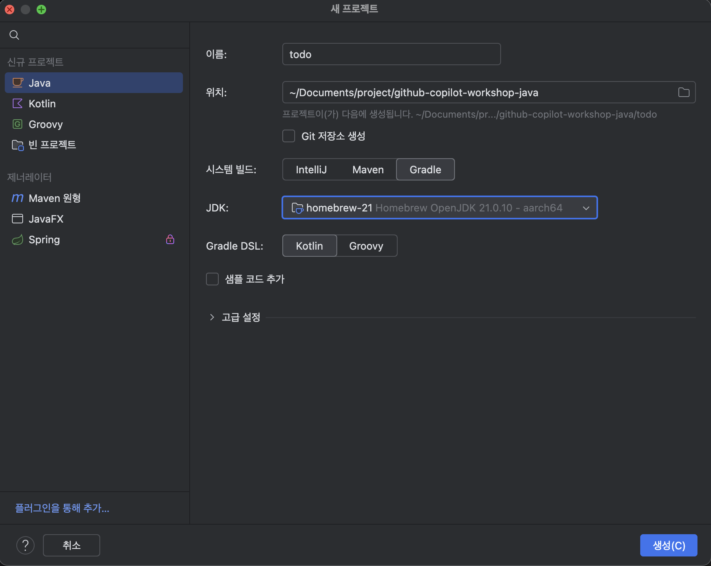
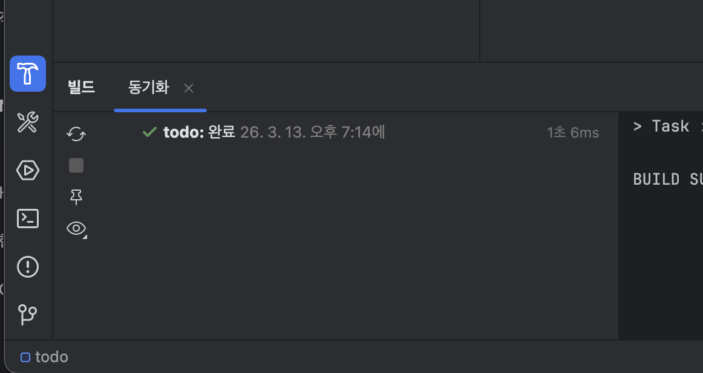
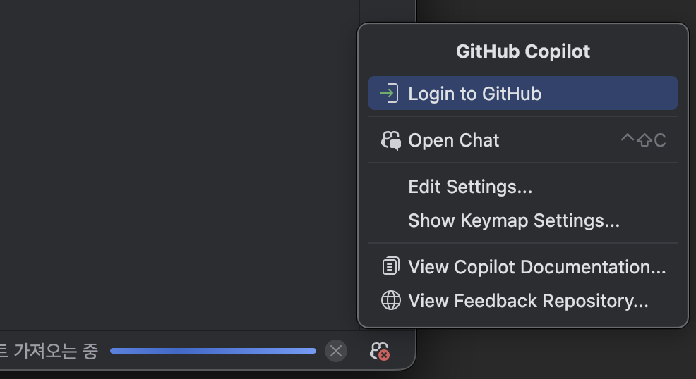
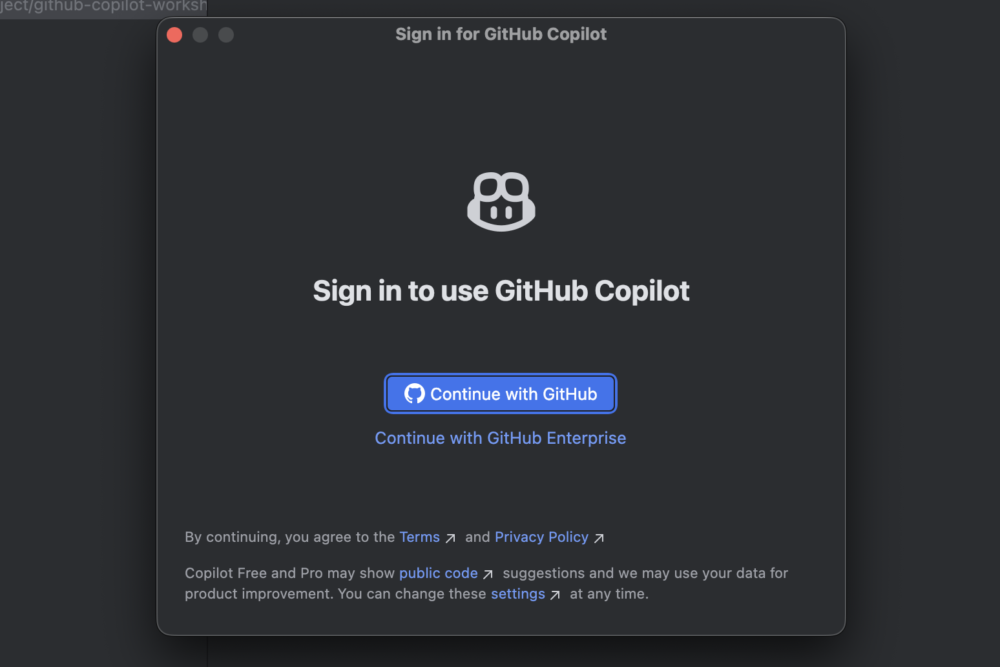
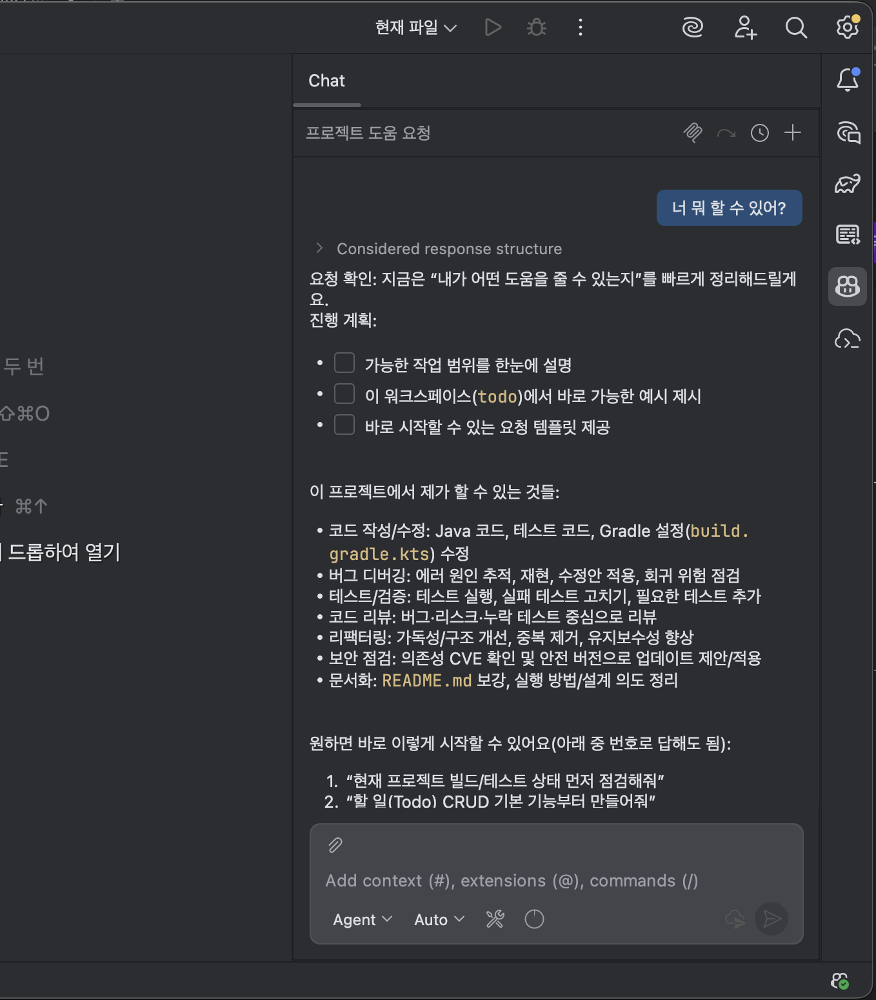

# Step 0. 환경 세팅

> ⏱️ 15분 | 난이도 ⭐
>
> Copilot과 개발 환경을 준비합니다.

---

## 사전 요구사항

- GitHub 계정 (Copilot 라이선스 활성화)
- JDK 17+
- Git

---

## JDK 설치 확인

### Java 설치 여부 확인

터미널(또는 IntelliJ Terminal)에서 다음 명령어를 실행하세요:

```bash
java -version
```

**정상 출력 예시:**
```
openjdk version "17.0.x" 2024-xx-xx
OpenJDK Runtime Environment ...
```

또는

```
openjdk version "21.0.x" 2024-xx-xx
OpenJDK Runtime Environment ...
```

`17` 이상의 버전이 출력되면 성공입니다! ✅

### Java가 설치되어 있지 않다면?

`java: command not found` 또는 버전이 17 미만이라면 JDK를 설치해야 합니다.


JDK가 설치되어 있지 않아도, 아래 **프로젝트 초기화** 단계에서 IntelliJ가 JDK를 자동으로 다운로드할 수 있습니다.
프로젝트 생성 마법사의 **JDK** 드롭다운에서 **JDK 다운로드...** 를 선택하면 원하는 버전을 바로 설치할 수 있습니다.

#### (옵션) 방법 1: 직접 설치

아래 예시는 JDK 17 기준이며, 원하는 버전(17, 21 등)으로 대체할 수 있습니다.

| OS | 설치 방법 |
|----|----------|
| **macOS** | `brew install openjdk@17` (또는 `brew install openjdk@21`) |
| **Windows** | [Adoptium](https://adoptium.net/) 에서 원하는 JDK 버전 다운로드 후 설치 |
| **Linux (Ubuntu)** | `sudo apt install openjdk-17-jdk` (또는 `openjdk-21-jdk`) |

설치 후 `java -version`으로 다시 확인하고, **출력된 메이저 버전을 기억**해 두세요.

> 💡 macOS에서 Homebrew가 없다면: `/bin/bash -c "$(curl -fsSL https://raw.githubusercontent.com/Homebrew/install/HEAD/install.sh)"`


#### (옵션) 방법 2: Copilot Agent에게 설치 시키기 🤖

Copilot Agent 모드를 사용하면 설치까지 한 번에 해결할 수 있습니다! IntelliJ Copilot Chat에서:

```
내 컴퓨터에 JDK가 설치되어 있는지 확인하고, 없으면 JDK 17 이상 버전을 설치해줘
```


---

## IntelliJ IDEA 환경 세팅

### IntelliJ IDEA 설치

[https://www.jetbrains.com/idea/](https://www.jetbrains.com/idea/) 에서 Community 또는 Ultimate 버전 설치

### Copilot 플러그인 설치

1. 처음 화면에서 `Plugins` 혹은  `Settings > Plugins > Marketplace`
2. "GitHub Copilot" 검색 → 설치

> 📸 **[IntelliJ 스크린샷]** Settings > Plugins > Marketplace에서 "GitHub Copilot"을 검색하여 설치하는 화면

>

3. IDE 재시작

---

## 프로젝트 초기화

### IntelliJ에서 Spring Boot 프로젝트 생성

IntelliJ IDEA의 **새 프로젝트** 마법사를 사용하여 프로젝트를 생성합니다.

1. IntelliJ 시작 화면에서 **새 프로젝트** 클릭 (또는 `File > New > Project...`)
2. 좌측 제너레이터 목록에서 **Spring** 선택
3. 다음 설정을 입력:

| 항목 | 값 |
|------|-----|
| 이름 | `todo` |
| 시스템 빌드 | **Gradle** |
| JDK | 설치된 JDK 선택 (`java -version`에서 확인한 버전) |
| Gradle DSL | **Kotlin** |
| 그룹ID | `com.example` |




#### JDK 선택 및 다운로드

**JDK** 드롭다운을 클릭하면 시스템에 설치된 JDK 목록이 표시됩니다:

- **등록된 JDK**: 이미 설치된 JDK 목록에서 선택
- **탐지된 JDK**: IntelliJ가 자동으로 찾은 JDK
- **JDK 다운로드...**: JDK가 없으면 여기서 원하는 버전을 선택하여 직접 다운로드

**생성** 클릭 → 프로젝트가 자동으로 열림

### Gradle 빌드 확인

IntelliJ에서 프로젝트를 열면 **Gradle 빌드가 자동으로 시작**됩니다.
좌측 사이드바의 **빌드 도구 아이콘**(🔨 망치 모양)을 클릭하면 빌드 진행 상황과 결과를 확인할 수 있습니다.




위 방법으로 해결되지 않으면 하단의 [🔧 빌드 에러가 나면?](#-빌드-에러가-나면)을 참고하세요.

---

## GitHub Copilot 로그인 및 테스트

### Github Copilot 로그인

프로젝트가 열리면 Copilot에 로그인합니다:

1. IntelliJ 하단 상태바에 **GitHub 아이콘**이 표시됩니다
2. GitHub 아이콘을 클릭하고 **Login to GitHub** 선택
3. 브라우저가 열리면 인증 코드를 입력하고 로그인
4. IntelliJ로 돌아오면 Copilot 활성화 완료




### Copilot 동작 확인

1. 우측 사이드바 또는 하단에 **GitHub Copilot** 아이콘 확인
2. `Open Chat` 눌러서 Github Copilot 패널 열기
3. `너 어떤거 할 수 있어?` 라고 입력 → Copilot이 응답하면 성공! ✅



---

## 트러블슈팅

<details>
<summary><strong>🔧 빌드가 되지 않는다면?</strong></summary>

### 1. 프로젝트 SDK 설정

| OS | 진입 경로 | 단축키 |
|----|----------|--------|
| **Mac** | `File > Project Structure` | `Cmd + ;` |
| **Windows** | `File > Project Structure` | `Ctrl + Alt + Shift + S` |

- 좌측 메뉴에서 **Project** 선택
- SDK가 `<No SDK>`로 되어 있다면 → `Add SDK > Download JDK` → `build.gradle.kts`에 명시된 버전(`java -version`에서 확인한 메이저 버전) 선택

### 2. Gradle JVM 설정 확인

| OS | 진입 경로 | 단축키 |
|----|----------|--------|
| **Mac** | `Settings` | `Cmd + ,` |
| **Windows** | `Settings` | `Ctrl + Alt + S` |

- `Build, Execution, Deployment > Build Tools > Gradle`로 이동
-  **Gradle JVM** 항목이 프로젝트의 JDK 버전과 일치하는지 확인
-  일치하지 않으면 드롭다운에서 올바른 JDK 버전으로 변경
-  **확인** 클릭 후 다시 빌드

### 3. Gradle 새로고침

설정 변경 후 반드시 실행:

- 우측 사이드바의 **Gradle 탭**(🐘 코끼리 아이콘) 열기
- 좌측 상단의 **Reload All Gradle Projects** (🔄 회전 화살표 아이콘) 클릭

</details>

---

## 다음 단계

→ [Step 1. Inline Suggestions](../step-01-inline/README.md)

</details>
