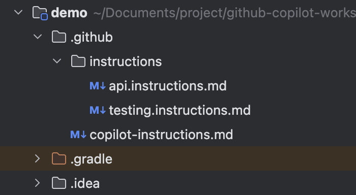
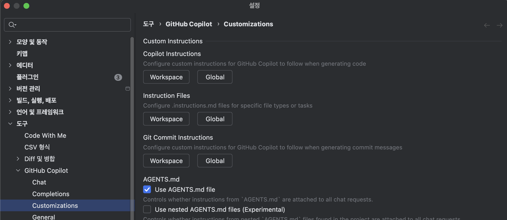
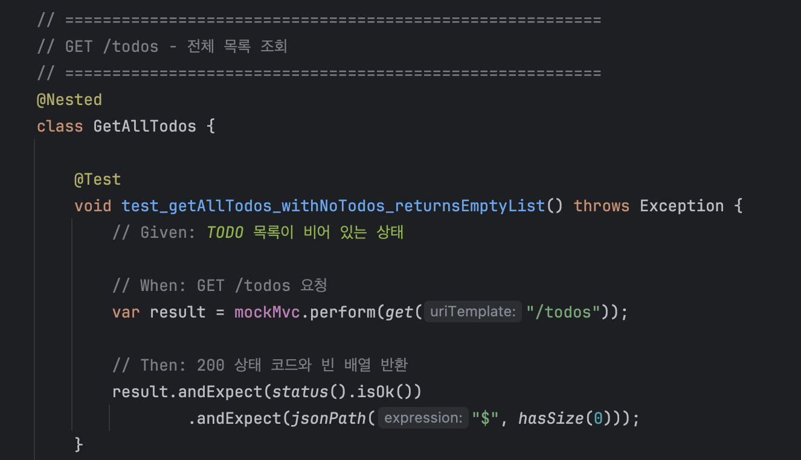
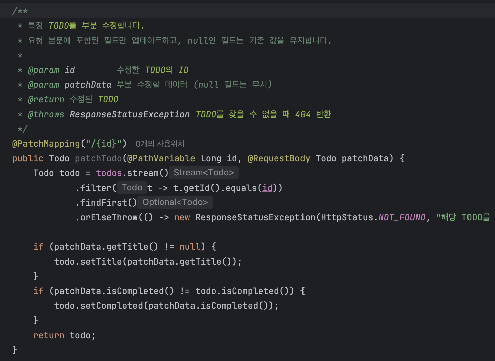

# Step 3. Instructions

> ⏱️ 20분 | 난이도 ⭐⭐
>
> 🎯 **핵심 학습: `copilot-instructions.md` + 경로 지정 지침(Path-specific Instructions)**
>
> **체감: "매번 같은 말 반복 안 해도 된다!"**

---

## 코드 폴더

| 폴더 | 설명 |
|------|------|
| `starter/` | Step 2 완성 코드 (Javadoc + 테스트 포함 TODO API) — 여기서 시작하세요 |
| `complete/` | 이번 스텝 완성 코드 — 막힐 때 참고하세요 |

---

## 왜 세 번째인가?

Step 2에서 Chat을 쓸 때 매번 같은 말을 반복하지 않았나요?

- "JUnit 5 쓰고 있어"
- "테스트 메서드명은 test_동작_조건_결과() 형식으로 해줘"
- "Controller에서 비즈니스 로직 쓰지 마"

**Instructions**는 이런 반복을 **한 번에 제거**합니다. 코드 컨벤션, 프로젝트 구조, 네이밍 규칙, 테스트 패턴 등 **항상 유지해야 하는 규칙**을 파일로 정의하면, Copilot이 매 응답마다 자동으로 반영합니다.

---

## 사용자 지정 지침(Custom Instructions)이란?

리포지토리에 사용자 지정 지침을 추가하면, 프로젝트를 이해하고 변경 내용을 작성 및 테스트하는 방법에 대해 Copilot을 안내할 수 있습니다.

Copilot은 다음 유형의 사용자 지정 지침 파일을 지원합니다:

- `.github/copilot-instructions.md` — **리포지토리 전체 지침** (항상 적용)
- `.github/instructions/**/*.instructions.md` — **경로 지정 지침** (특정 파일에만 적용)

```
.github/
├── copilot-instructions.md          ← 리포지토리 전체 지침 (항상 적용)
└── instructions/
    ├── testing.instructions.md      ← tests/** 에서만 적용
    └── api.instructions.md          ← *Controller.java 파일에만 적용
```



🔧 **설정에서 지침 확인하기**

IntelliJ 설정에서 등록된 지침 파일을 확인할 수 있습니다:
**Settings** (`Windows/Linux: Ctrl+Alt+S`, `macOS: Cmd+,`) → **Tools** → **GitHub Copilot** → **Customizations**



> 📖 자세한 내용: [GitHub Copilot에 대한 리포지토리 사용자 지정 지침 추가하기](https://docs.github.com/ko/copilot/how-tos/configure-custom-instructions/add-repository-instructions?tool=vscode)

> 📖 지원 범위: [Custom Instructions 지원 현황](https://docs.github.com/en/copilot/reference/custom-instructions-support)

---

## 태스크 1: 리포지토리 전체 지침 작성 (5분)

`.github/copilot-instructions.md` 생성:

```markdown
# 프로젝트 규칙

## 언어
- 모든 응답은 한국어로 작성
- 코드 주석, Javadoc도 한국어

## 기술 스택
- Java 17+ / Spring Boot 3.x / Spring Web
- 데이터 저장: 인메모리 List (ArrayList)
- 테스트: JUnit 5 + MockMvc + @SpringBootTest
- 빌드: Gradle (Kotlin DSL)

## 코드 스타일
- 클래스명: PascalCase (예: TodoController)
- 메서드명: camelCase (예: createTodo, findById)
- 상수: UPPER_SNAKE_CASE (예: MAX_TITLE_LENGTH)
- 테스트 메서드: test_동작_조건_결과() (예: test_createTodo_withValidData_returns201)

## API 규칙
- RESTful 엔드포인트
- @ResponseStatus로 상태 코드 명시 (CREATED, NO_CONTENT 등)
- 에러는 ResponseStatusException으로 처리
- 에러 메시지는 한국어

## 테스트 규칙
- @Nested 클래스로 엔드포인트별 그룹핑
- Given-When-Then 주석 패턴 사용
```

---

## 태스크 2: 경로 지정 지침 작성 (10분)

### 테스트 전용 규칙

`.github/instructions/testing.instructions.md`:

```markdown
---
applyTo: "**/test/**"
---
# 테스트 규칙

## 프레임워크
- JUnit 5 + @SpringBootTest + MockMvc

## 네이밍
- 메서드명: test_동작_조건_결과()
  - 예: test_createTodo_withValidData_returns201()
  - 예: test_getTodo_withInvalidId_returns404()

## 구조
- @Nested 클래스로 엔드포인트별 그룹핑
- Given-When-Then 주석 패턴 사용
  - 예시:
    ```java
    @Test
    void test_createTodo_withValidData_returns201() throws Exception {
        // Given: 유효한 TODO 데이터
        String json = """
            {"title": "테스트", "description": "설명"}
            """;

        // When: POST /todos 요청
        var result = mockMvc.perform(post("/todos")
            .contentType(MediaType.APPLICATION_JSON)
            .content(json));

        // Then: 201 상태 코드와 생성된 TODO 반환
        result.andExpect(status().isCreated())
              .andExpect(jsonPath("$.title").value("테스트"));
    }
    ```
- 각 테스트는 독립적 (@Transactional 사용)

## 커버리지
- 정상 케이스 + 에러 케이스 + 경계값 각각 최소 1개
- 모든 HTTP 상태 코드 테스트
```

### API 코드 전용 규칙

`.github/instructions/api.instructions.md`:

```markdown
---
applyTo: "**/*Controller.java"
---
# API 코드 규칙

## 엔드포인트
- @ResponseStatus로 상태 코드 명시 (CREATED, NO_CONTENT 등)
- @Valid로 요청 검증
- 메서드 파라미터 타입 명확히 지정

## 에러 처리
- 404: ResponseStatusException(HttpStatus.NOT_FOUND, "메시지")
- 400: @Valid + MethodArgumentNotValidException 자동 처리
- 에러 메시지는 한국어

## 구조
- Controller는 비즈니스 로직 없이 Service 위임만
- 반환 타입은 DTO (Entity 직접 반환 금지)
```

---

## 태스크 3: 지침 동작 실습 및 검증 (10분)

앞서 생성한 지침 파일들이 실제로 Copilot에 올바르게 적용되는지 확인합니다.

### 1. 리포지토리 전체 지침 동작 확인

`TodoControllerTest.java` 파일을 열고 Chat에 입력:
앞서 생성한 지침 파일들이 실제로 Copilot에 올바르게 적용되는지 확인합니다.
**.github/copilot-instructions.md, .github/instructions/testing.instructions.md**

```
Instructions에 설정된 규칙을 설명해주고, 그 규칙에 맞게 프로젝트를 리팩토링해줘
```

지침이 적용되면 다음이 변경됩니다:

- [ ] 테스트 메서드명이 `test_동작_조건_결과()` 패턴으로 변경되었는가? (예: `test_createTodo_withValidData_returns201`)
- [ ] `@Nested` 클래스로 엔드포인트별 그룹핑이 추가되었는가?
- [ ] `// Given:` / `// When:` / `// Then:` 주석 패턴이 추가되었는가?



어떤 인스트럭션을 참고했는지 알고 싶으면 아래 명령을 입력하세요:

```
참고한 모든 인스트럭션 경로를 포함한 이름 알려줘
```

### 2. API 코드 경로 지정 지침 확인

`TodoController.java` 파일을 열고 Chat에 입력:
적용될 지침: **.github/copilot-instructions.md, .github/instructions/api.instructions.md**

```
PATCH /todos/{id} 부분 수정 엔드포인트를 추가해줘
```

지침이 적용되면 다음이 변경됩니다:

- [ ] **에러 처리**: `ResponseStatusException(HttpStatus.NOT_FOUND, "한국어 메시지")`로 404를 처리하는가?
- [ ] **에러 메시지**: 에러 메시지가 한국어로 작성되었는가?
- [ ] **메서드 파라미터**: `@PathVariable Long id`, `@RequestBody Todo patchData` 등 타입이 명확히 지정되었는가?




어떤 인스트럭션을 참고했는지 알고 싶으면 아래 명령을 입력하세요:

```
참고한 모든 인스트럭션의 경로를 포함한 이름 알려줘
```

---

## ✅ 검증 체크리스트

### 태스크 1: 리포지토리 전체 지침
- [ ] `.github/copilot-instructions.md` 파일 생성 완료

### 태스크 2: 경로 지정 지침
- [ ] `.github/instructions/testing.instructions.md` 생성 완료
- [ ] `.github/instructions/api.instructions.md` 생성 완료

### 태스크 3: 지침 동작 실습 및 검증
- [ ] 리포지토리 전체 지침 적용 확인: `@Nested` 그룹핑, Given-When-Then 주석, 테스트 네이밍 변경 등이 반영됨
- [ ] 테스트 경로 지정 지침 확인: `test_동작_조건_결과()` 네이밍 패턴, Given-When-Then 주석 적용됨
- [ ] API 경로 지정 지침 확인: Service 위임 구조, DTO 반환 타입 적용됨
- [ ] 경로 지정 지침이 해당 폴더에서만 적용됨을 확인

---

## 핵심 인사이트

> **"사용자 지정 지침 = AI에 대한 투자"**
>
> 한 번 잘 써두면 Copilot의 **모든 응답**이 달라집니다.
> 팀에서는 이 파일을 Git에 커밋하여 **팀 AI 컨벤션**으로 사용할 수 있습니다.

---

## 다음 단계

→ [Step 4. Prompt Files](../step-04-prompt-files/README.md)
