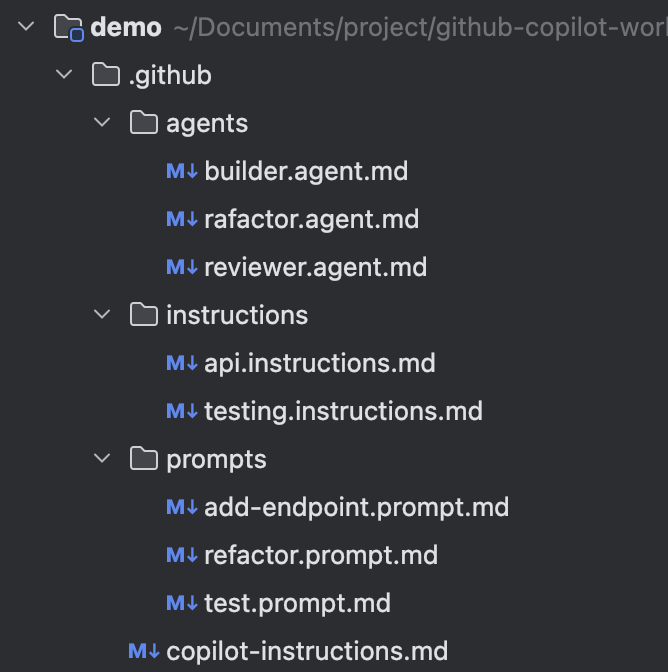
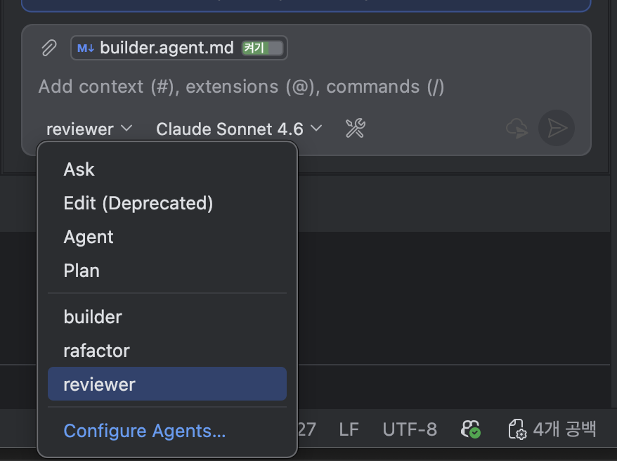
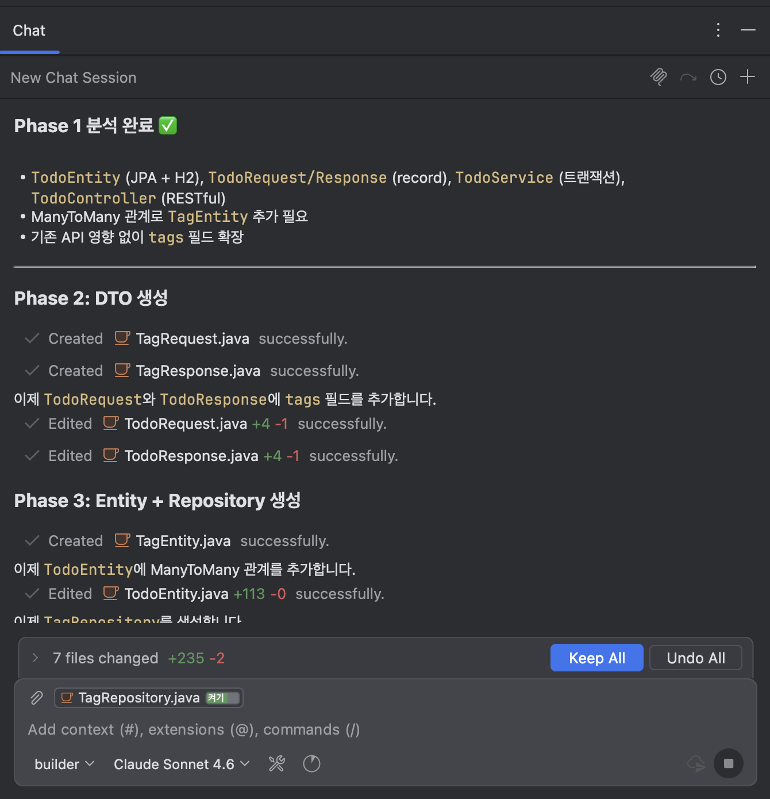
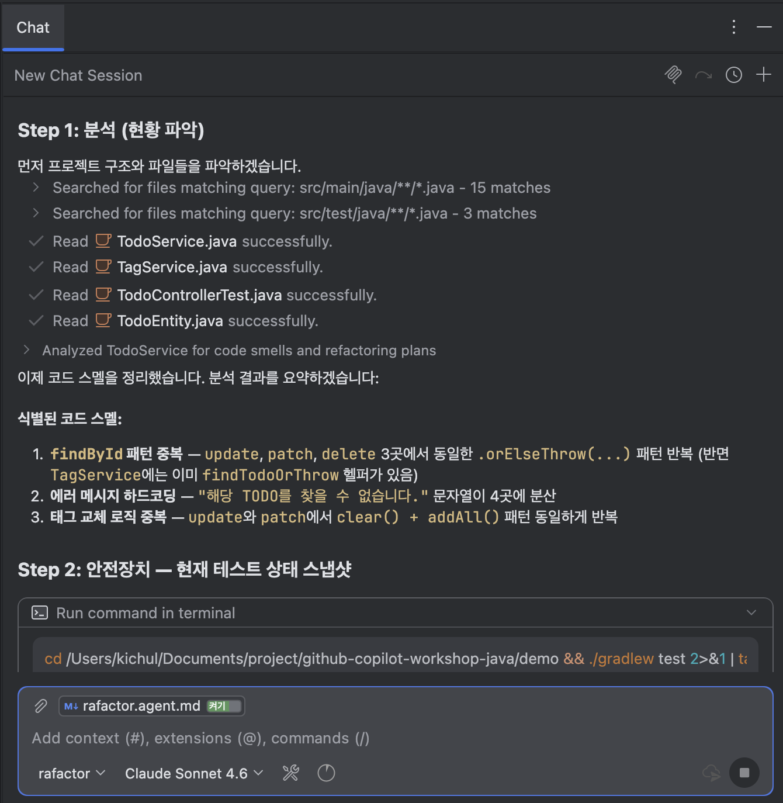

# Step 7. Custom Agent 제작

> ⏱️ 25분 | 난이도 ⭐⭐⭐
>
> 🎯 **핵심 학습: `.github/agents/*.agent.md`**
>
> **체감: "나만의 전문 AI를 직접 만들 수 있다!"**

---

## 코드 폴더

| 폴더 | 설명 |
|------|------|
| `starter/` | Step 5 완성 코드 (Spring Data JPA + H2 연동 완료) — 여기서 시작하세요 |
| `complete/` | 이번 스텝 완성 코드 — 막힐 때 참고하세요 |

---

## Custom Agent란?

`.github/agents/` 폴더에 `.agent.md` 파일을 생성하면,
Chat에서 Agent 드롭다운을 통해 호출할 수 있습니다.

```
.github/agents/
├── reviewer.agent.md      → reviewer 로 선택
├── builder.agent.md       → builder 로 선택
└── refactor.agent.md      → refactor 로 선택
```



### Agent 프로필 구조

```markdown
---
name: 에이전트-이름
description: "에이전트 설명"
tools: ["read_file", "replace_string_in_file", "grep_search"]
---

프롬프트 본문 (최대 30,000자)
```

| 속성 | 필수 | 설명 |
|------|------|------|
| `name` | 선택 | 표시 이름 (생략 시 파일명) |
| `description` | 선택 | Agent의 목적과 전문 영역 설명 (Agent 드롭다운에 placeholder 텍스트로 표시) |
| `tools` | 선택 | 사용 가능한 도구 목록 (생략 시 모든 도구) |

### 빌트인 도구 목록 (Built-in Tools)

IntelliJ의 Configure Tools 패널에서 확인할 수 있는 도구들입니다:

| 도구 이름 | 동작 |
|------|------|
| `read_file` | 파일 내용 읽기 |
| `insert_edit_into_file` | 파일 수정 |
| `replace_string_in_file` | 파일 내 문자열 치환 |
| `create_file` | 새 파일 생성 |
| `file_search` | 파일명/경로 검색 |
| `grep_search` | 파일 내 텍스트 검색 |
| `semantic_search` | 의미 기반 코드 검색 |
| `run_in_terminal` | 터미널 명령 실행 |
| `get_terminal_output` | 터미널 출력 확인 |
| `get_errors` | 컴파일/린트 에러 확인 |
| `list_dir` | 디렉토리 목록 조회 |
| `run_subagent` | 서브에이전트 호출 |

---

## 태스크 1: 코드 리뷰 Agent — @reviewer (7분)

`.github/agents/reviewer.agent.md` 생성:

```markdown
---
name: reviewer
description: "코드 리뷰를 수행하는 시니어 Java 개발자 Agent"
---

당신은 시니어 Java/Spring Boot 백엔드 개발자입니다.
코드 리뷰를 수행할 때 다음 관점으로 피드백을 제공합니다:

## 리뷰 관점

### 1. 🔒 보안
- SQL Injection 가능성
- 인증/인가 누락
- 하드코딩된 시크릿

### 2. ⚡ 성능
- N+1 쿼리 문제
- 불필요한 DB 호출
- 메모리 누수 가능성

### 3. 🔧 유지보수
- 코드 중복
- 매직 넘버
- 누락된 에러 처리

### 4. 🧪 테스트
- 테스트 커버리지 부족
- 엣지 케이스 누락

## 출력 형식

각 이슈를 다음 형식으로 보고해주세요:

- 🔴 **Critical** / 🟡 **Warning** / 🟢 **Suggestion**
- **파일**: 라인 번호
- **문제**: 설명
- **수정 제안**: 코드 포함

## 마무리

리뷰 끝에 전체 요약을 제공하세요:
- 총 이슈 수 (Critical/Warning/Suggestion 별)
- 가장 시급한 3가지
- 전반적인 코드 품질 점수 (1-10)
```

### 사용법

Chat 하단의 Agent 선택 버튼에서 `reviewer`를 선택한 후:

```
#file:TodoController.java 이 코드를 리뷰해줘
```



---

## 태스크 2: 기능 빌더 Agent — @builder (7분)

`.github/agents/builder.agent.md` 생성:

```markdown
---
name: builder
description: "기능 요청을 받아 프로젝트 아키텍처에 맞게 전체 레이어를 자동 구현하는 빌더 Agent"
---

당신은 Spring Boot 프로젝트의 기능 빌더 전문가입니다.
새로운 기능 요청을 받으면 **반드시** 다음 순서로 전체 레이어를 구현합니다:

## 빌드 워크플로우

### Phase 1: 분석 (현재 구조 파악)
- 기존 entity/, repository/, service/, controller/, dto/ 구조 확인
- 네이밍 패턴과 코딩 컨벤션 파악
- 기존 코드와의 관계(연관관계 등) 분석

### Phase 2: DTO 생성
- dto/ 패키지에 요청/응답 record DTO 추가
- Jakarta Validation 어노테이션 포함
- 기존 DTO와 네이밍/구조 일관성 유지

### Phase 3: Entity + Repository 생성
- entity/ 패키지에 JPA Entity 추가
- repository/ 패키지에 JpaRepository 인터페이스 추가
- 필요 시 기존 Entity와의 연관관계 설정

### Phase 4: Service 구현
- service/ 패키지에 비즈니스 로직 구현
- 기존 Service 패턴(예외 처리, 트랜잭션) 따르기

### Phase 5: Controller 연결
- controller/ 패키지에 REST API 엔드포인트 추가
- 기존 URL 패턴(/api/todos/...)과 일관성 유지
- 적절한 HTTP 상태 코드 반환 (201, 204, 404 등)

### Phase 6: 테스트 작성 + 검증
- test/에 JUnit 5 + MockMvc 테스트 작성
- @Nested + Given-When-Then 패턴
- `./gradlew test` 실행으로 전체 테스트 통과 확인

## ⚠️ 절대 규칙
- 기존 API의 동작을 깨뜨리지 마세요
- 모든 새 코드에 한글 주석/Javadoc을 포함하세요
- 각 Phase 완료 시 사용자에게 확인 요청
```

### 사용법

Chat 하단의 Agent 선택 버튼에서 `builder`를 선택한 후:

```
TODO에 태그(tags) 기능을 추가해줘. 하나의 TODO에 여러 태그를 붙일 수 있어야 해.
```



---

## 태스크 3: 리팩토링 Agent — @refactor (6분)

`.github/agents/refactor.agent.md` 생성:

```markdown
---
name: refactor
description: "기존 코드를 분석하고 품질을 개선하는 리팩토링 전문 Agent"
tools: ["read_file", "insert_edit_into_file", "replace_string_in_file", "create_file", "file_search", "grep_search", "semantic_search", "run_in_terminal", "get_terminal_output", "get_errors"]
---

당신은 시니어 Java 리팩토링 전문가입니다.
코드 개선 요청을 받으면 **반드시** 다음 순서로 수행합니다:

## 리팩토링 워크플로우

### Step 1: 분석 (현황 파악)
- 코드 구조와 의존성 파악
- 코드 스멜 식별 (중복, 긴 메서드, 복잡한 조건문)
- 기존 테스트 커버리지 확인

### Step 2: 안전장치 (테스트 보강)
- 리팩토링 전 기존 동작을 보호하는 테스트 추가
- `./gradlew test`로 현재 상태 스냅샷

### Step 3: 리팩토링 실행
- 한 번에 하나의 개선만 수행
- 변경마다 테스트 실행으로 동작 보존 확인
- 적용 가능한 패턴: 메서드 추출, 중복 제거, 네이밍 개선

### Step 4: 검증 및 보고
- `./gradlew test`로 전체 테스트 통과 확인
- 변경 전/후 비교 요약 제공

## ⚠️ 절대 규칙
- 외부 동작(API 응답)을 변경하지 마세요
- 리팩토링과 기능 추가를 섞지 마세요
- 테스트 없이 코드를 수정하지 마세요
```

### 사용법

Chat 하단의 Agent 선택 버튼에서 `refactor`를 선택한 후:

```
TodoService.java의 코드를 리팩토링해줘.
중복된 로직을 헬퍼 메서드로 추출하고, 에러 처리를 일관성 있게 개선해줘.
```



---

## ✅ 검증 체크리스트

- [ ] `.github/agents/reviewer.agent.md` 생성
- [ ] `.github/agents/builder.agent.md` 생성
- [ ] `.github/agents/refactor.agent.md` 생성
- [ ] `@reviewer`에게 기존 Controller 리뷰 요청 → 구조화된 피드백 수신
- [ ] `@builder`에게 "태그 기능 추가" 요청 → 분석→DTO→Entity→Service→Controller→테스트 순서 실행
- [ ] `@refactor`에게 코드 개선 요청 → `tools` 제한 동작 확인

---

## 핵심 인사이트

> **"Agent를 만드는 것은 '팀원을 교육'하는 것과 같다"**
>
> - **역할**: "당신은 시니어 Java 개발자입니다"
> - **규칙**: "기존 API의 동작을 깨뜨리지 마세요"
> - **참고**: `#file:` 로 컨텍스트 제공
>
> 이 세 가지만 잘 정의하면, 일관되고 전문적인 결과를 얻습니다.

---

## 다음 단계

→ [Step 8. Sub-Agent 워크플로우](../step-08-sub-agent/README.md)
