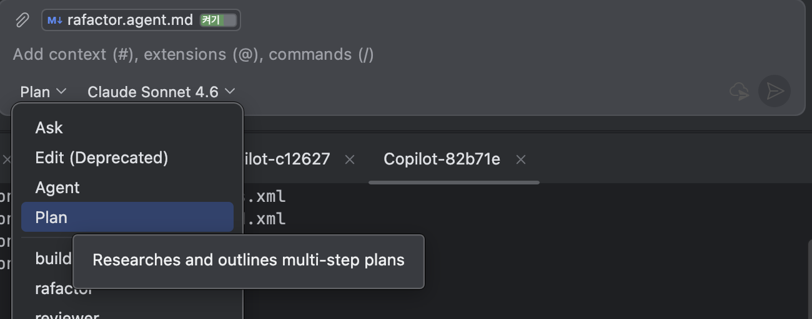
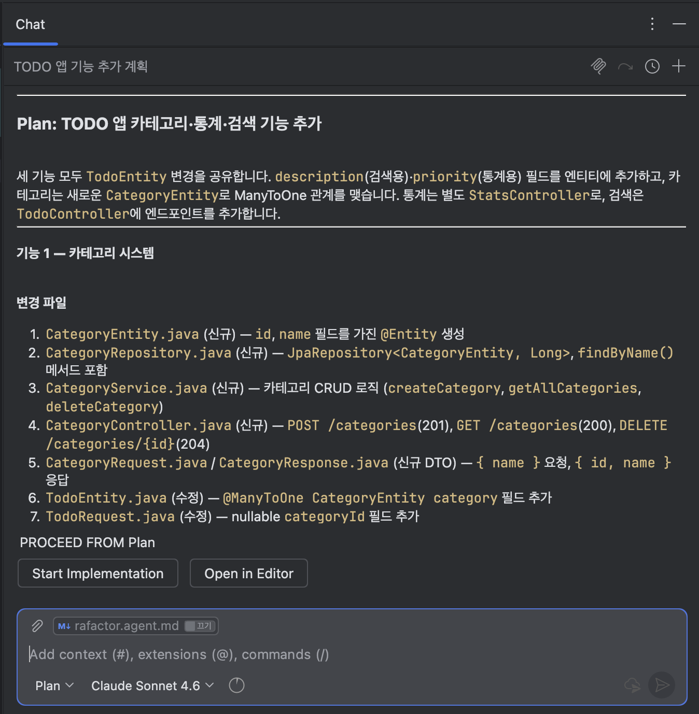
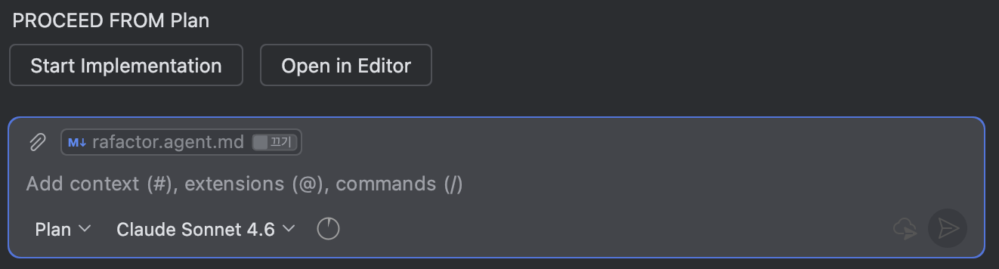
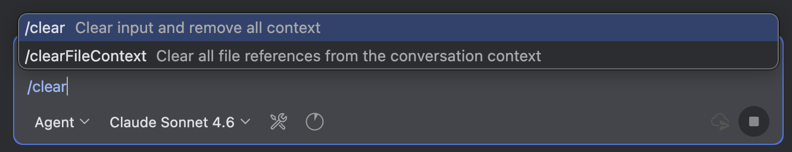

# Step 8. 고급 워크플로우 — Plan 기능 + Custom Agent 조합

> ⏱️ 25분 | 난이도 ⭐⭐⭐
>
> 🎯 **핵심 학습: Copilot Plan 기능으로 체계적 개발**
>
> **체감: "큰 기능도 체계적으로!"****

---

## 코드 폴더

| 폴더 | 설명 |
|------|------|
| `starter/` | **빈 Spring Boot 프로젝트** (build.gradle.kts, Application 클래스만 존재) — 여기서 시작하세요 |
| `complete/` | 이번 스텝 완성 코드 — 막힐 때 참고하세요 |

> 💡 **왜 처음부터?**
> 앞 스텝에서 만든 TODO API 코드를 **모두 지우고** 빈 프로젝트에서 시작합니다.
> Plan 기능 + Agent 조합으로 설계 → 테스트 → 구현 → 리뷰를 **처음부터 끝까지** 자동으로 수행하는 과정을 체험하기 위해서입니다.

---

## Copilot Plan 기능이란?

Agent 모드에서 Copilot에게 큰 작업을 요청하면, 바로 코드를 생성하는 대신
**구현 계획(Plan)을 먼저 제시**하도록 할 수 있습니다.

- Chat 입력창 하단 **Agent 선택 버튼**에서 `Plan` 에이전트 선택



---

## 태스크: Plan → 구현 (25분)

### Step 1 — Plan으로 계획 수립

Plan 모드 Chat에 입력:

```
TODO 앱에 다음 3가지 기능을 추가하려고 해:

1. 카테고리 시스템 — TODO에 카테고리를 지정할 수 있게
2. 통계 API — 카테고리별 완료율, 우선순위 분포
3. 검색 기능 — 제목/설명 키워드 검색

각 기능에 대해 필요한 파일 변경, DTO, 테스트 케이스를 정리해줘.
```



### Step 2 — 구현

계획을 확인했으면 구현을 시작합니다:

#### 방법 A: `Start Implementation` 버튼 (한 번에 실행)

Plan 결과 하단의 **`Start Implementation`** 버튼을 클릭하면, 계획 전체를 순서대로 자동 실행합니다.



#### 방법 B: Chat에서 기능별로 요청 (단계적 실행)

```
위 계획에 따라 1번 카테고리 시스템부터 구현해줘.
테스트도 작성하고 ./gradlew test로 통과까지 확인해줘.
```

통과를 확인한 뒤 다음 기능으로 넘어갑니다:

```
다음으로 2번 통계 API를 구현해줘. 구현 후 테스트까지 통과시켜줘.
```

### Step 3 — Production-Ready 보강

다시 Agent 모드로 전환하여 production 기능을 추가합니다.

```
TODO 앱에 production-ready 기능을 추가해줘:
- CORS 설정 (localhost:5173, localhost:3000)
- Health check 엔드포인트 (GET /health — Spring Actuator 사용)
- 요청/응답 로깅 필터
- 구조화된 로깅 설정 (Logback)

테스트도 업데이트하고 전체 통과까지.
```

### 💡 Context Rot과 `/clear`

Step 1 → 3을 이어서 진행하다 보면 대화가 매우 길어집니다.
Agent의 응답 품질이 떨어지는 것을 느끼면 — 이것이 **Context Rot**입니다.

**징후**: 이전에 만든 코드를 무시함, 같은 실수를 반복함, 엉뚱한 파일을 수정함

**해결법:**

```
/clear
```


초기화 후 핵심 파일만 참조하여 재시작:

```
#file:TodoController.java #file:TodoService.java #file:dto/

위 파일들을 기반으로, CORS 필터와 health check 엔드포인트를 추가해주세요.
```

---

## ✅ 검증 체크리스트

- [ ] Plan 기능으로 3개 기능의 구현 계획을 세움
- [ ] 카테고리 시스템 구현 + 테스트 통과
- [ ] 통계 API 구현 + 테스트 통과
- [ ] 검색 기능 구현 + 테스트 통과
- [ ] Production-ready 기능 추가 (CORS, health check, logging)

---

## 핵심 인사이트

> **"Plan으로 방향을 잡고, Agent로 실행하라"**
>
> - **Plan 기능**: 큰 작업은 바로 코딩하지 않고 계획부터 세운다
> - **기능별 반복**: 한 번에 다 만들지 않고 구현 → 검증을 반복한다

---

## 다음 단계

축하합니다! 🎉 메인 트랙의 모든 단계를 완료했습니다!

**다음 스텝**으로 넘어가세요:
→ [Step 9. Spec-Driven Development](../step-09-spec-driven/README.md)

완료 후 원하는 **보너스 트랙**을 선택하세요:
- **[Step 10 — README 문서화](../step-10-bonus-readme/README.md)**: Copilot으로 프로젝트 README + Mermaid 다이어그램 생성
- **[Step 11 — Docker](../step-11-bonus-a-docker/README.md)**: Copilot으로 Docker 컨테이너화 (Layered Jar)
- **[Step 12 — React.js 프론트엔드](../step-12-bonus-b-react/README.md)**: TODO API를 소비하는 React UI
- **[Step 13 — 레거시 마이그레이션](../step-13-bonus-c-migration/README.md)**: 클래식 ASP → Java 전환
- **[Step 14 — Spec Kit](../step-14-bonus-e-speckit/README.md)**: Spec-Driven Development 자동화
