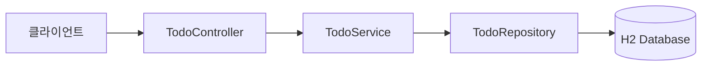
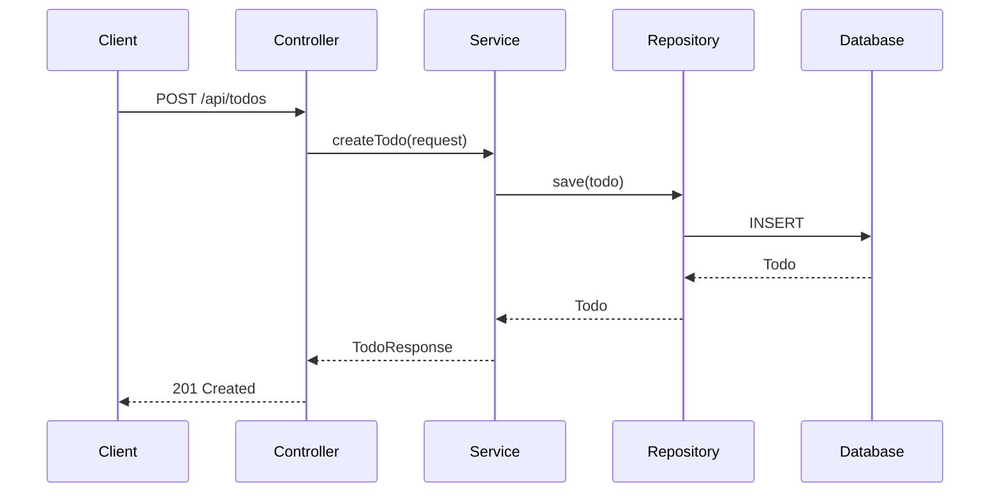

# Step 10. 프로젝트 README 문서 생성

> ⏱️ 15분 | 난이도 ⭐
>
> 🎯 **핵심 학습: Copilot으로 프로젝트 문서화 + Mermaid 다이어그램 생성**
>
> **체감: "README와 아키텍처 다이어그램까지 AI가 만들어준다!"**

---

## 왜 프로젝트 문서화인가?

코드를 작성하는 것만큼 중요한 것이 **프로젝트 문서화**입니다.
좋은 README는 프로젝트의 첫인상이자, 다른 개발자(또는 미래의 나)가 프로젝트를 이해하는 출발점입니다.

Copilot은 코드를 분석하여 다음을 자동으로 생성할 수 있습니다:

- 📄 **README.md** — 프로젝트 소개, 설치 방법, API 문서
- 📊 **Mermaid 다이어그램** — 아키텍처, ERD, 시퀀스 다이어그램
- 📋 **API 문서** — 엔드포인트 목록, 요청/응답 예시

---

## 태스크 1: 프로젝트 README 생성 (5분)

### 1-1. 전체 프로젝트 README 생성

Copilot Chat(Agent 모드)에서:

```
이 프로젝트의 소스 코드를 분석해서 README.md를 작성해줘.

다음 섹션을 포함해줘:
- 프로젝트 소개 (한 줄 요약 + 상세 설명)
- 기술 스택
- 프로젝트 구조 (폴더/파일 트리)
- 설치 및 실행 방법
- API 엔드포인트 목록 (메서드, 경로, 설명, 상태 코드)
- 테스트 실행 방법

한글로 작성하고, 마크다운 표와 코드 블록을 활용해줘.
```

### 관찰 포인트
- [ ] Copilot이 코드를 분석하여 정확한 엔드포인트를 나열하는가?
- [ ] 프로젝트 구조가 실제 파일과 일치하는가?
- [ ] 설치/실행 명령이 올바른가?

---

## 태스크 2: Mermaid 다이어그램 생성 (5분)

### 2-1. 아키텍처 다이어그램

```
이 프로젝트의 아키텍처를 Mermaid 다이어그램으로 그려줘.

다음을 포함해줘:
- 클라이언트 → Controller → Service → Repository → DB 흐름
- 각 계층의 주요 클래스명
- 화살표에 주요 메서드명 표시

Mermaid flowchart 또는 graph 문법을 사용해줘.
```

### 2-2. ERD (Entity Relationship Diagram)

```
이 프로젝트의 데이터 모델을 Mermaid ERD로 그려줘.

각 엔티티의 필드명, 타입, 관계를 포함해줘.
Mermaid erDiagram 문법을 사용해줘.
```

### 2-3. API 시퀀스 다이어그램

```
TODO 생성(POST /api/todos) API의 처리 흐름을 
Mermaid 시퀀스 다이어그램으로 그려줘.

Client → Controller → Service → Repository → DB 순서로,
유효성 검사 실패 시 분기도 포함해줘.
```

### Mermaid 다이어그램 예시

아래와 같은 다이어그램이 생성됩니다:





> 💡 **참고**: GitHub, IntelliJ, VS Code 모두 Mermaid 렌더링을 지원합니다.
> README.md에 포함하면 자동으로 다이어그램이 표시됩니다.

---

## 태스크 3: 문서를 README에 통합 (5분)

### 3-1. 전체 통합

```
위에서 만든 내용을 하나의 README.md로 통합해줘.

구성:
1. 프로젝트 소개 + 기술 스택
2. 아키텍처 다이어그램 (Mermaid)
3. ERD (Mermaid)
4. 프로젝트 구조
5. 설치 및 실행 방법
6. API 엔드포인트 목록
7. 테스트 실행 방법

각 섹션에 적절한 Mermaid 다이어그램을 삽입해줘.
```

### 관찰 포인트
- [ ] 다이어그램이 코드의 실제 구조를 정확히 반영하는가?
- [ ] README가 프로젝트를 처음 보는 사람도 이해할 수 있는가?
- [ ] Mermaid 문법이 올바르게 렌더링되는가?

---

## ✅ 검증 체크리스트

- [ ] README.md에 프로젝트 소개, 기술 스택, 구조가 포함됨
- [ ] 아키텍처 다이어그램 (Mermaid flowchart/graph)
- [ ] ERD 다이어그램 (Mermaid erDiagram)
- [ ] 시퀀스 다이어그램 (Mermaid sequenceDiagram)
- [ ] API 엔드포인트 목록이 실제 코드와 일치
- [ ] 설치/실행/테스트 명령이 올바르게 동작

---

## 🔧 다이어그램이 안 보이면?

### GitHub에서 렌더링 확인

GitHub에 푸시하면 Mermaid 다이어그램이 자동으로 렌더링됩니다.
로컬에서 미리보기를 보려면:

- **IntelliJ**: Markdown 파일 열기 → 우측 미리보기 패널
- **VS Code**: `Markdown Preview Mermaid Support` 확장 설치

### 문법 오류가 있을 때

```
이 Mermaid 다이어그램에 문법 오류가 있어. 수정해줘:

[오류가 있는 Mermaid 코드 붙여넣기]
```

---

## 핵심 인사이트

> **"코드뿐 아니라 문서도 AI와 함께"**
>
> - Copilot은 코드를 분석하여 **정확한 문서**를 생성합니다
> - Mermaid 다이어그램으로 **시각적 아키텍처 문서**를 자동 생성
> - README는 프로젝트의 첫인상 — AI가 초안을 만들고 사람이 다듬으면 효율적

---

## 다음 단계

→ [Step 11. Docker](../step-11-bonus-a-docker/README.md)
