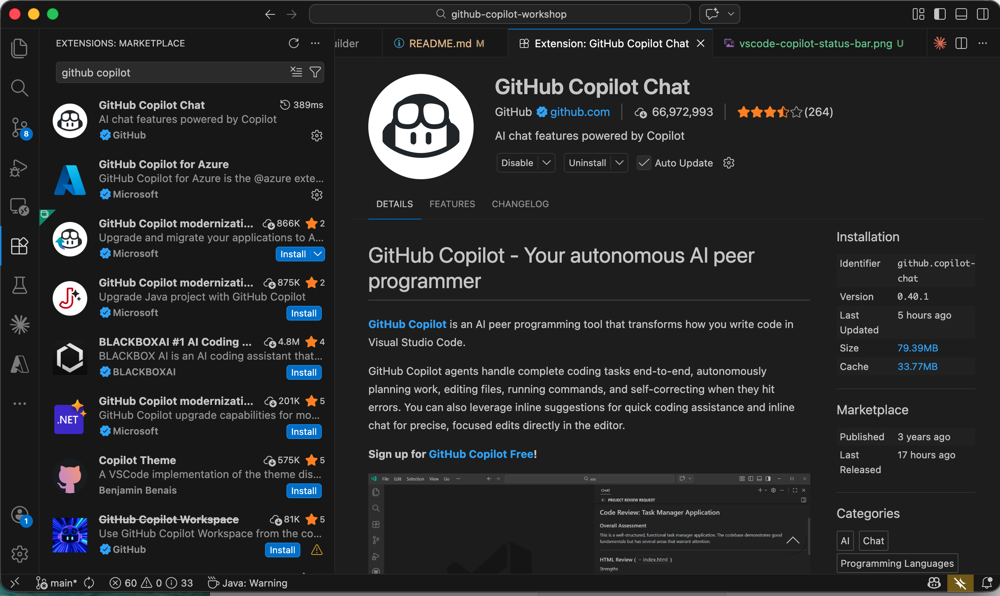
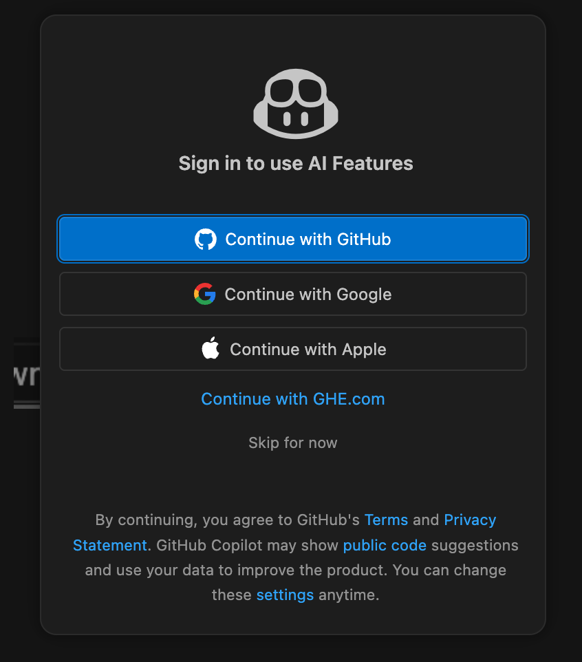
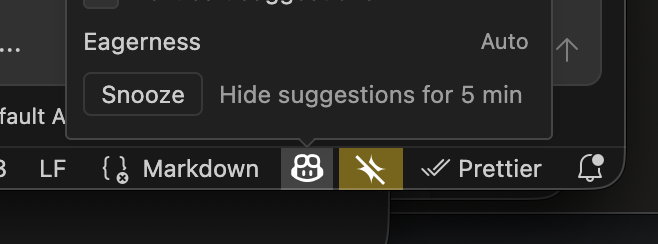
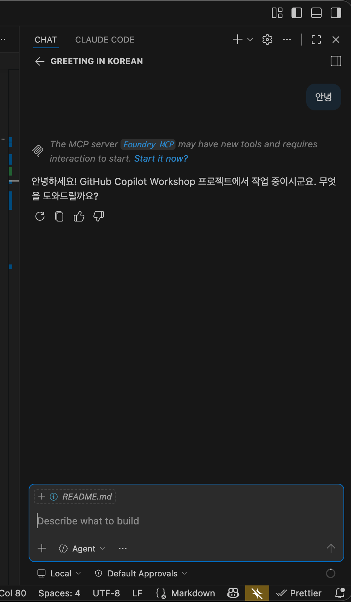

# Step 0. 환경 세팅

> ⏱️ 15분 | 난이도 ⭐
>
> Copilot과 개발 환경을 준비합니다.

---

## 사전 요구사항

- GitHub 계정 (Copilot 라이선스 활성화)
- Python 3.11+

---

## VS Code 환경 세팅

### 1. VS Code 설치

[https://code.visualstudio.com/](https://code.visualstudio.com/) 에서 최신 버전 설치

### 2. 확장 설치

| 확장 | 설명 |
|------|------|
| **GitHub Copilot** | 코드 자동완성, Chat, Agent 모드 통합 AI 어시스턴트 |



### 3. Copilot 로그인

1. 하단 상태 바에서 `Signed out` 버튼 클릭


2. GitHub 계정으로 로그인



3. 상태 바에 Copilot 아이콘 ✅ 표시 확인



### 4. 동작 확인

상태 바(좌측 하단)에 Copilot 아이콘 클릭 → **Inline Suggestions**가 `All files` 체크 ✅ 상태인지 확인

### 5. Copilot Chat 열기

중앙 상단 말풍선 아이콘 클릭 → Copilot Chat 패널이 열리면 성공 ✅




---

## 프로젝트 초기화

### 1. VS Code에서 빈 프로젝트 생성

1. VS Code 실행
2. `File > Open Folder...` 클릭
3. 원하는 위치에 `todo-app` 폴더를 새로 만들고 선택

### 2. VS Code 터미널에서 환경 설정

상단 메뉴 `Terminal > New Terminal`로 터미널을 열고 아래 명령어를 실행:

**macOS / Linux:**
```bash
# Python 가상환경 생성 및 활성화
python -m venv .venv
source .venv/bin/activate

# 의존성 설치 (서버 실행에 필요한 최소한만)
pip install fastapi uvicorn
```

**Windows (PowerShell):**
```powershell
# Python 가상환경 생성 및 활성화
python -m venv .venv
.venv\Scripts\activate

# 의존성 설치 (서버 실행에 필요한 최소한만)
pip install fastapi uvicorn
```
```
Python 3.12 으로 가상환경을 .venv 폴더에 생성하고 활성화한 뒤, fastapi와 uvicorn을 설치해줘
```

**Copilot에게 시키기:**

Copilot Chat 패널을 열고, 좌측 하단 모드를 **Agent**로 변경한 뒤 아래 프롬프트를 입력합니다:


> 💡 `python` 명령어가 동작하지 않으면 `python3`으로 대체하세요. (예: `python3 -m venv .venv`)

### 3. 프로젝트 디렉터리 구조 생성

VS Code 사이드바에서 아래 구조대로 폴더와 파일을 생성합니다:

1. 좌측 Explorer 패널에서 **New Folder** 아이콘 클릭 → `app` 폴더 생성
2. `app` 폴더 안에 **New File** 아이콘 클릭 → `__init__.py` 파일 생성 (내용 비워둠)
3. 같은 방법으로 `tests` 폴더와 `tests/__init__.py` 생성
4. 루트에 `requirements.txt` 파일 생성하고 아래 내용 입력:

```
fastapi
uvicorn
```

---

## 검증

### Python 환경 확인

```bash
python -c "import fastapi; print('FastAPI:', fastapi.__version__)"
```

버전이 출력되면 성공! ✅

---

## 프로젝트 구조 (완성 시)

```
todo-app/
├── .venv/
├── app/
│   ├── __init__.py
│   └── (이후 단계에서 추가)
├── tests/
│   ├── __init__.py
│   └── (이후 단계에서 추가)
└── requirements.txt
```

---

## 다음 단계

→ [Step 1. Inline Suggestions](../step-01-inline/README.md)
