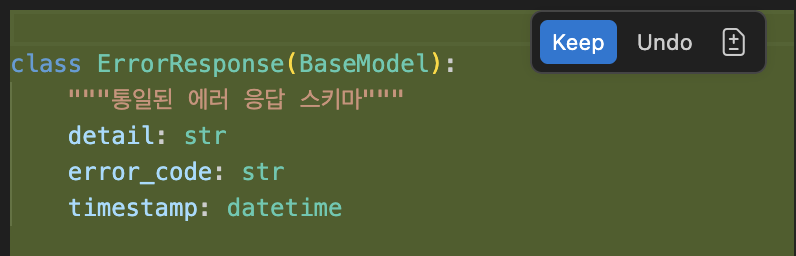

# Step 5. Skills

> ⏱️ 15분 | 난이도 ⭐⭐
>
> 🎯 **핵심 학습: `.github/skills/<name>/SKILL.md`**
>
> **체감: "Copilot이 우리 팀의 에러 처리 규칙을 알고 있다!"**

---

## 코드 폴더

| 폴더 | 설명 |
|------|------|
| `starter/` | Step 4 완성 코드 (기본 CRUD + Prompt Files) — 여기서 시작하세요 |
| `complete/` | 이번 스텝 완성 코드 (+ Skills 추가) — 막힐 때 참고하세요 |

---

## 왜 Skills인가?

Step 3의 **Instructions**가 "항상 적용되는 규칙"이고,
Step 4의 **Prompt Files**가 "필요할 때 꺼내 쓰는 매크로"라면,
**Skills**는 "Copilot이 상황에 맞게 자동으로 꺼내 쓰는 전문 지식"입니다.

| 구분 | Instructions | Prompt Files | Skills |
|------|-------------|--------------|--------|
| 적용 시점 | 항상 자동 | `/명령어`로 수동 호출 | Copilot이 관련성 판단 시 자동 |
| 용도 | 프로젝트 규칙 | 반복 작업 자동화 | 도메인 전문 지식 |
| 비유 | 교칙 | 도구 상자 | 전문가 참고서 |

> 📖 **참고**: [GitHub 공식 문서 — About agent skills](https://docs.github.com/copilot/concepts/agents/about-agent-skills)

---

## Skills란?

Skills는 `.github/skills/` 디렉토리에 위치하는 Markdown 파일로, Copilot Agent가 특정 도메인에 대한 **모범 사례(best practices)** 를 자동으로 참고할 수 있게 합니다.

### Instructions와의 차이점

- **Instructions** (`.github/copilot-instructions.md`): 모든 대화에 항상 포함
- **Skills** (`.github/skills/<skill-name>/SKILL.md`): Copilot이 대화 맥락을 분석하여 관련성이 높을 때 자동으로 포함

### Skills 파일 구조

`.github/skills/<skill-name>/SKILL.md` 형식으로 작성합니다:

```markdown
---
name: skill-name
description: '이 스킬이 다루는 내용에 대한 설명'
---

# 스킬 제목

여기에 모범 사례, 규칙, 가이드라인 등을 작성합니다.
```

- **YAML Frontmatter** (`---` 사이): `name`과 `description`은 필수입니다. Copilot이 이 정보를 기반으로 스킬의 관련성을 판단합니다.
- **본문**: Markdown 형식으로 상세 가이드를 작성합니다.

---

## 태스크 1: 에러 처리 Skills 파일 생성 (5분)

### 1-1. Skills 디렉토리 생성

프로젝트 루트에서 `.github/skills/` 디렉토리를 만드세요:

```
.github/
├── copilot-instructions.md              ← Step 3에서 생성 (항상 적용)
├── instructions/
│   ├── testing.instructions.md          ← Step 3에서 생성 (테스트 파일에 적용)
│   └── api.instructions.md              ← Step 3에서 생성 (라우트 핸들러에 적용)
├── prompts/                             ← Step 4에서 생성
│   ├── test-code.prompt.md
│   ├── refactor.prompt.md
│   └── spec-implement.prompt.md
└── skills/                              ← 이번 스텝에서 생성!
    └── fastapi-error-handling/
        └── SKILL.md                     → Copilot이 에러 처리 관련 요청 시 자동 참고
```

### 1-2. Skills 파일 작성

`.github/skills/fastapi-error-handling/SKILL.md` 파일을 만들고 아래 내용을 붙여넣으세요:

```markdown
---
name: fastapi-error-handling
description: 'FastAPI 애플리케이션의 에러 처리 및 예외 관리 모범 사례'
---

# FastAPI 에러 처리 모범 사례

목표는 FastAPI 애플리케이션에서 일관되고 사용자 친화적인 에러 응답을 제공하는 것입니다.

## 커스텀 예외 클래스

- 도메인별 커스텀 예외를 정의합니다. (예: `TodoNotFoundError`, `DuplicateTodoError`)
- 기본 예외 클래스를 만들어 공통 속성을 관리합니다.
- 예외에는 항상 사용자 친화적인 한국어 메시지를 포함합니다.

```python
class AppException(Exception):
    """애플리케이션 기본 예외 클래스"""
    def __init__(self, message: str, status_code: int = 400):
        self.message = message
        self.status_code = status_code

class TodoNotFoundError(AppException):
    """TODO 항목을 찾을 수 없을 때 발생하는 예외"""
    def __init__(self, todo_id: int):
        super().__init__(
            message=f"TODO(id={todo_id})를 찾을 수 없습니다",
            status_code=404
        )
```

## 에러 응답 스키마

- 모든 에러 응답은 통일된 JSON 구조를 따릅니다:
  ```json
  {
    "detail": "에러 메시지",
    "error_code": "NOT_FOUND",
    "timestamp": "2024-01-01T00:00:00Z"
  }
  ```
- Pydantic `BaseModel`로 에러 응답 스키마를 정의합니다.
- `response_model`과 `responses`를 엔드포인트에 명시합니다.

## 예외 핸들러 등록

- `@app.exception_handler()`로 커스텀 예외를 처리합니다.
- 전역 예외 핸들러로 예상치 못한 에러를 잡습니다.
- 에러 로깅을 포함합니다.

```python
@app.exception_handler(AppException)
async def app_exception_handler(request: Request, exc: AppException):
    return JSONResponse(
        status_code=exc.status_code,
        content={"detail": exc.message, "error_code": exc.error_code}
    )
```

## HTTP 상태 코드 규칙

- `400 Bad Request`: 잘못된 입력 데이터
- `404 Not Found`: 리소스를 찾을 수 없음
- `409 Conflict`: 중복 리소스 생성 시도
- `422 Unprocessable Entity`: 유효성 검증 실패 (FastAPI 기본)
- `500 Internal Server Error`: 예상치 못한 서버 에러

## 유효성 검증 에러

- Pydantic `ValidationError`는 FastAPI가 자동으로 422로 변환합니다.
- 추가 비즈니스 규칙 검증은 커스텀 예외로 처리합니다.
- 검증 에러 메시지는 한국어로 작성합니다.

## 에러 처리 안티패턴

- ❌ 빈 `except:` 블록 사용 금지
- ❌ 에러를 삼키지 않기 (조용히 무시하지 않기)
- ❌ 500 에러에 내부 구현 세부사항 노출 금지
- ❌ `HTTPException`을 직접 raise하는 대신 커스텀 예외 사용
- ✅ 항상 적절한 로깅과 함께 에러를 처리
```

---

## 태스크 2: Skills 동작 확인 (5분)

### 2-1. 에러 처리 추가 요청

Copilot Chat (Agent 모드)에서 에러 처리 추가를 요청해 보세요:

```
TODO API에 체계적인 에러 처리를 추가해줘
```

### 2-2. Skills 적용 확인

Copilot이 생성한 코드에서 다음 사항을 확인하세요:

- [ ] 커스텀 예외 클래스가 정의되었는가? (예: `TodoNotFoundError`)
- [ ] 통일된 에러 응답 JSON 구조를 따르는가?
- [ ] `@app.exception_handler()`로 예외 핸들러가 등록되었는가?
- [ ] 적절한 HTTP 상태 코드가 사용되었는가? (404, 400 등)



> 💡 Skills가 없을 때와 비교하면 차이가 확연합니다. Skills 파일을 삭제하고 같은 요청을 해보면 Copilot이 단순히 `HTTPException`만 사용하는 것을 확인할 수 있습니다.

---

## 태스크 3: 추가 Skills 파일 만들기 (5분, 선택)

팀에서 활용할 수 있는 Skills 예시:

| 파일명 | 용도 |
|--------|------|
| `fastapi-error-handling/SKILL.md` | 에러 처리 및 예외 관리 모범 사례 |
| `python-pytest/SKILL.md` | pytest 테스트 모범 사례 |
| `fastapi-rest/SKILL.md` | FastAPI REST API 설계 규칙 |
| `python-logging/SKILL.md` | 로깅 표준 (logging 모듈) |
| `code-review/SKILL.md` | 코드 리뷰 체크리스트 |

---

## 완성 확인

- [ ] `.github/skills/fastapi-error-handling/SKILL.md` 파일이 생성됨
- [ ] Copilot이 에러 처리 작성 시 Skills의 규칙을 참고함
- [ ] 커스텀 예외 클래스, 통일된 에러 응답 등 Skills에 명시된 패턴이 적용됨

---

## 핵심 인사이트

> **"Skills로 팀의 전문 지식을 Copilot에게 가르쳐라"**
>
> Instructions는 "항상 지켜야 할 규칙"이고, Skills는 "특정 상황에서 참고할 전문 지식"입니다:
> - Copilot이 맥락에 따라 자동으로 관련 Skills를 선택
> - 팀의 모범 사례를 코드화하여 일관성 유지
> - Git에 커밋하여 팀 전체가 동일한 품질 기준 공유

---

## 다음 단계

→ [Step 6. Agent 모드](../step-06-agent/README.md)
