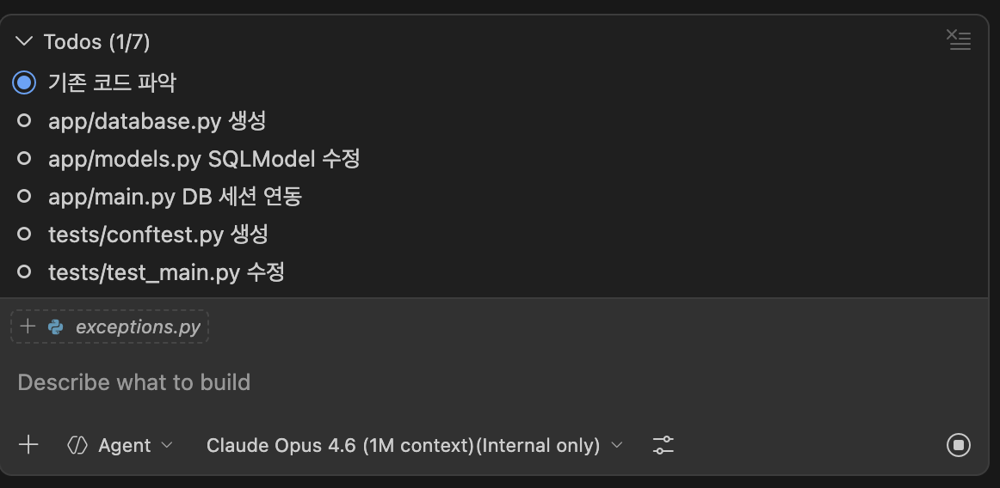
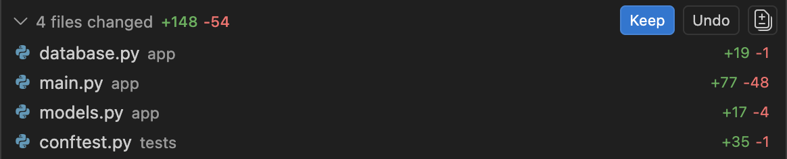

# Step 6. Agent에게 복잡한 작업 위임하기

> ⏱️ 25분 | 난이도 ⭐⭐⭐
>
> 🎯 **핵심 학습: Agent에게 아키텍처 변경을 통째로 위임**
>
> **체감: "한마디에 파일 5개가 동시에 바뀌고, 테스트까지 알아서 돌린다!"**

---

## 코드 폴더

| 폴더 | 설명 |
|------|------|
| `starter/` | Step 5 완성 코드 (Prompt Files + due_date 기능 포함) — 여기서 시작하세요 |
| `complete/` | 이번 스텝 완성 코드 — 막힐 때 참고하세요 |

---

## Agent 모드 확인

Chat 입력창에서 좌측 드롭다운 → "Agent" 선택

---

## 태스크: Agent에게 DB 연동 전체 위임 (20분)

지금까지는 Agent에게 "함수 하나 만들어줘", "테스트 작성해줘" 같은 **단위 작업**을 시켰습니다.
이번에는 **"in-memory → SQLite로 전환해줘"** 라는 **아키텍처 레벨의 요청**을 한 번에 던집니다.

### 프롬프트

Agent 모드 Chat에 입력:

```
TODO 앱에 SQLite 데이터베이스를 연동해줘.

요구사항:
1. SQLModel 사용 (Pydantic + SQLAlchemy 통합)
2. 기존 in-memory dict를 SQLite로 완전히 교체
3. app/database.py에 DB 엔진 설정 (SQLite 파일: todo.db)
4. app/models.py에 SQLModel 테이블 모델 정의
5. 기존 스펙(app/schemas.py)은 유지
6. 기존 엔드포인트가 DB Session을 사용하도록 수정
7. 마이그레이션은 SQLModel.metadata.create_all()로 간단히
8. 테스트용 임시 DB 설정 (tests/conftest.py)
9. 기존 테스트 모두 통과하도록 수정

```

### Agent의 작업 관찰 — 이전 단계와 뭐가 다른가?

이전 단계에서 Agent는 파일 1~2개를 수정했습니다.
이번에는 Agent가 **스스로 계획을 세우고 연쇄적으로 작업**하는 것을 관찰하세요:

1. **`app/database.py` 생성** — 새 파일을 스스로 판단하여 생성
2. **`app/models.py` 수정** — SQLModel 테이블 모델로 변환
3. **`app/main.py` 수정** — Depends(get_session)으로 DB 주입
4. **`tests/conftest.py` 생성** — 테스트 인프라까지 자동 구성
5. **`tests/test_todos.py` 수정** — DB 세션 의존성 오버라이드
6. **터미널에서 `pytest` 실행** — 스스로 검증하고 실패하면 수정까지

> 💡 단일 파일 수정이 아닌 **6단계 연쇄 작업**을 하나의 프롬프트로 수행합니다.

> 📸 **스크린샷**: Agent가 여러 파일을 연쇄적으로 수정하는 모습
> 

### ⚠️ 중요: 승인/거부

Agent가 파일을 변경할 때마다 **diff를 확인**할 수 있습니다:
- ✅ **Keep** — 변경 적용
- ❌ **Undo** — 변경 거부
- 📝 **수정 요청** — "이 부분은 다르게 해줘"



> **팁**: 한 번에 모든 변경을 수락하지 말고, 파일별로 리뷰하세요!

---

## 생성되는 핵심 코드 미리보기

### app/database.py

```python
from sqlmodel import SQLModel, create_engine, Session

DATABASE_URL = "sqlite:///./todo.db"
engine = create_engine(DATABASE_URL, echo=True)

def create_db_and_tables():
    SQLModel.metadata.create_all(engine)

def get_session():
    with Session(engine) as session:
        yield session
```

### app/main.py (변경 부분)

```python
from fastapi import Depends
from sqlmodel import Session, select
from app.database import get_session, create_db_and_tables

@app.on_event("startup")
def on_startup():
    create_db_and_tables()

@app.get("/todos", response_model=TodoListResponse)
def get_todos(
    session: Session = Depends(get_session),
    priority: Priority | None = None,
    page: int = 1,
    size: int = 10,
):
    ...
```

---

## 검증

```bash
# 테스트 실행
pytest -v

# 서버 실행
uvicorn app.main:app --reload

# Swagger UI 확인
# http://localhost:8000/docs

# TODO 생성 후 todo.db 파일 생성 확인
ls -la todo.db
```

---

## ✅ 검증 체크리스트

- [ ] Agent가 `app/database.py`를 생성함
- [ ] `app/models.py`가 SQLModel 테이블로 변환됨
- [ ] `app/main.py`에서 DB Session 주입 사용
- [ ] `tests/conftest.py` 테스트 DB 설정 추가
- [ ] SQLite 파일(`todo.db`)이 서버 시작 시 생성됨
- [ ] `pytest -v` 전체 통과
- [ ] Swagger UI에서 CRUD 동작 확인
- [ ] 서버 재시작해도 데이터가 유지됨

---

## 핵심 인사이트

> **"Agent에게는 큰 그림을, 승인은 작은 단위로"**
>
> - **이전 단계와의 차이**: 단위 작업 → 아키텍처 변경 위임
> - 요구사항은 구체적이고 상세하게 전달 (번호 매긴 목록이 효과적)
> - 하지만 변경은 파일 하나씩 리뷰
> - Agent가 실수하면 "이 부분 다시 해줘"로 즉시 수정
> - 복잡한 작업일수록 Agent가 빛을 발합니다 (다중 파일 동시 수정)
> - Agent가 **스스로 테스트를 실행하고 오류를 수정**하게 하면 생산성이 극대화됩니다

---

## 다음 단계

→ [Step 7. Custom Agent 제작](../step-07-custom-agent/README.md)
