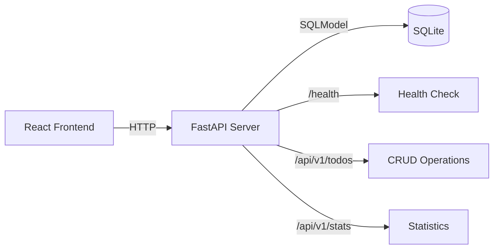

# Bonus A. 추가 실습 — 다양한 시나리오

> 개별 30분씩 | 난이도 ⭐⭐~⭐⭐⭐ | **체감: "실전 시나리오에서 Copilot 활용!"
>
> 🎯 **목표**: Docker, 문서 자동화, 언어 마이그레이션 등 다양한 실전 시나리오 체험

---

## 📝 실습 A-1: 언어 마이그레이션 (30분)

> Python TODO 앱을 다른 언어로 변환합니다.

### 목표 언어 (택 1)

| 언어 | 프레임워크 | 난이도 |
|------|----------|--------|
| Go | Gin / Echo | ⭐⭐ |
| Rust | Actix-web / Axum | ⭐⭐⭐ |
| TypeScript | Express / Hono | ⭐ |

### 실습 방법

**💬 Copilot Agent:**
```
#file:step-06-agent/complete/app/main.py
#file:step-06-agent/complete/app/models.py
#file:step-06-agent/complete/app/schemas.py

위 Python FastAPI 코드를 Go (Gin 프레임워크)로 변환해줘.

조건:
- 동일한 API 엔드포인트 (/api/v1/todos)
- SQLite 사용
- 같은 JSON 응답 형식
- 같은 유효성 검사 규칙
- 테스트 코드도 포함
```

### 관찰 포인트
- [ ] Copilot이 언어 간 패턴 차이를 이해하는가?
- [ ] 에러 핸들링 방식이 언어에 맞게 변환되는가?
- [ ] ORM 매핑이 올바른가?
- [ ] 어디서 수동 수정이 필요한가?

---

## 🐳 실습 A-2: Docker & docker-compose (30분)

> TODO 앱을 컨테이너화합니다.

### Step 1: Dockerfile 생성

**💬 Copilot Agent:**
```
Python FastAPI TODO 앱을 위한 Dockerfile을 만들어줘.

요구사항:
- Python 3.11 slim 베이스 이미지
- 멀티스테이지 빌드 (선택)
- 비루트 사용자로 실행
- 헬스 체크 포함
- .dockerignore 도 만들어줘
```

### Step 2: docker-compose.yml 생성

**💬 Copilot Agent:**
```
docker-compose.yml을 만들어줘.

서비스:
1. api: FastAPI 앱 (포트 8000)
2. (선택) postgres: PostgreSQL DB (SQLite 대신)
3. (선택) frontend: React 앱 (포트 5173)

설정:
- 환경 변수로 DB URL 주입
- 볼륨 마운트로 데이터 영속화
- 네트워크 설정
- depends_on + healthcheck
```

### Step 3: 실행 및 확인

```bash
# 빌드 & 실행
docker-compose up --build

# 확인
curl http://localhost:8000/health
curl http://localhost:8000/api/v1/todos
```

### 관찰 포인트
- [ ] Copilot이 보안 모범 사례를 따르는가? (비루트 사용자 등)
- [ ] 멀티스테이지 빌드를 제안하는가?
- [ ] 환경 변수 분리를 제안하는가?

---

## 📖 실습 A-3: 문서 자동화 (30분)

> API 문서와 프로젝트 문서를 자동 생성합니다.

### Step 1: OpenAPI Spec 활용

**💬 Copilot Chat:**
```
FastAPI가 자동 생성하는 OpenAPI spec을 가져와서 
API 사용 가이드 문서(API-GUIDE.md)를 만들어줘.

포함 내용:
- 각 엔드포인트 설명
- 요청/응답 예시 (curl 명령어)
- 에러 코드 설명
- 인증 정보 (현재는 없음)
```

### Step 2: README.md 자동 생성

**💬 Copilot Agent:**
```
이 프로젝트의 README.md를 생성해줘.

포함 내용:
- 프로젝트 설명
- 기술 스택
- 설치 방법
- 실행 방법
- API 엔드포인트 요약 테이블
- 테스트 실행 방법
- 환경 변수 설명
- 라이선스
```

### Step 3: 아키텍처 다이어그램

**💬 Copilot Chat:**
```
이 프로젝트의 아키텍처를 Mermaid 다이어그램으로 그려줘.

포함 내용:
1. 시스템 구성도 (Client → API → DB)
2. 프로젝트 폴더 구조 트리
3. API 흐름도 (요청 → 미들웨어 → 핸들러 → DB → 응답)
```

**예시 (Mermaid):**


### 관찰 포인트
- [ ] 문서가 실제 API와 정확히 일치하는가?
- [ ] curl 예시가 올바르게 동작하는가?
- [ ] Mermaid 다이어그램이 렌더링 되는가?

---

## ✅ 전체 체크리스트

### A-1: 언어 마이그레이션
- [ ] 다른 언어로 API 변환 완료
- [ ] 동일한 엔드포인트 동작 확인
- [ ] 테스트 코드 포함

### A-2: Docker
- [ ] Dockerfile 생성 및 빌드 성공
- [ ] docker-compose 로 서비스 실행
- [ ] 헬스 체크 통과

### A-3: 문서 자동화
- [ ] API 가이드 문서 생성
- [ ] README.md 생성
- [ ] 아키텍처 다이어그램 생성

---

## 💡 핵심 인사이트

- **마이그레이션**: `#file` 로 기존 코드를 참조하면 변환 품질이 높아집니다
- **Docker**: Copilot은 Dockerfile 패턴을 잘 알지만, 보안 설정은 반드시 검토하세요
- **문서화**: 코드를 컨텍스트로 제공하면 정확한 문서를 생성합니다. 하지만 항상 실제 동작과 대조하세요
